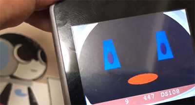
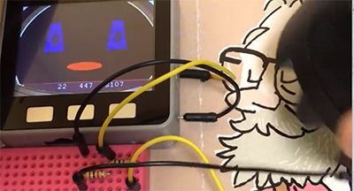
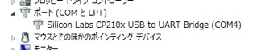

# Q-bo_BLEScanner (v1.6)
Q-bo BLE Scannerは、Robi2の付属品であるQ-boからBLE信号を受け取って、その信号に応じた音声ファイルを再生させるとともに、画面上に表示されたQ-bo風の音声に合わせて顔が動くというものです。
どのようなプログラムなのかは、以下の像をクリックすると操作中の動画をで観ることができます。(動画は旧バージョンです） 

###更新
- Odroid-GO対応
- スリープ対応
- 再生した音声IDの表示を復活させた
- M5Stack 0.27, ESP32 1.02でビルド

## インストール

### ① M5Stack/Odroid-GOに入れるmicroSDを作る
1. microSDに**Q-boのココロ**の中身をコピーします。
2. 同梱のファイルの中にmicroSDフォルダの中の中のファイルを、microSDにコピーします。その際に、**注意が必要なのは、jpgフォルダとjsonフォルダです。**jpgフォルダやjsonフォルダが既にある場合は、それぞれの中にあるファイルをコピーして下さい。
3. これでmicroSDの作成は終了です。

### ② USBドライバーをインストールする
M5Stackをコンピュータと繋いで、プログラムの転送など通信するためには、Silicon LabsのUSBDriverをインストールする必要があります。もしまだインストールしてなければ
[シリアル接続の確立方法](https://docs.m5stack.com/#/ja/related_documents/establish_serial_connection)
のサイトを参考にしてインストールして下さい。

> なお、Macの場合、インストールしただけではセキュリティが通ってないので、インストール後、環境設定のセキュリティとプライバシーの一般で、インストールしたドライバーの許可をして下さい。
> 

### ③ M5Burner_Micで、M5StackにSD-Menuをインストールする
"M5Burner\_Mic"というプログラムでSD-MenuをM5Stackにインストールします。すでにSD-MenuまたはLovyanLauncherをインストールしてある場合はこのステップは必要ありません。

1. [M5Burner_Mic](https://github.com/micutil/M5Burner_Mic) のページから「Download [here](http://micutil.com/download/M5Burner_Mic.zip)」の所でM5Burner\_Micをダウンロードし、解凍して下さい。M5Burner\_Micフォルダはお好みの場所に入れて下さい。
2. M5Stackに付いてきたUSB-CケーブルでパソコンとM5Stackを繋げて下さい。
3. M5Burner\_Micをダブルクリックして起動します。
4. USBシリアルポートをM5Stackのポートに設定します。
 - Macの場合はポートに名前がつくので「**SLAB_USBtoUART**」という名前のポートを選んで下さい。
 - Windowsの場合は、**COM3**とか、COM4とかの名前になっています。ひとつしか表示されてなかったら、それがM5Stackのポートでしょう。もしいくつか表示されているようだったら、コントロールパネルから、デバイスマネージャーのポートをみて番号を確認して下さい。例えば以下の図の場合だと**COM4**であるということになります。 
5. 「Priset」のポップアップメニューでM5Stack用もしくはOdroid-GO用の「**SD-Menu**」の最新版を選択します。
6. 「**Start**」ボタンをクリックすると、プログラムの転送が開始します。
7. プログラムの転送が終わるとM5Stackがリセットされ、インストールした**SD-Menu**が起動します。
8. M5StackのCボタン（右）を何回か押して、Q-bo\_BLE_Scannerを選択し、Bボタン（中央）のボタンを押すと、RSTesterが起動します。操作方法は後で説明します。
9. microSDにmenu.binが入ってない場合は、M5Burner_Micのfirmwaresフォルダの中のtobozoフォルダの中のM5StackもしくはOdroid-GOのフォルダの中に**menu.bin**があるので、それをmicroSDにコピーして下さい。
9. 再度、メニューを表示する場合は、Aボタン（左）を押しながらリセットボタン（左上側面）を押すとQ-bo\_BLE_Scannerが起動します。

## Arduinoを使う場合に必要な設定
2. ESP用のAudio関連のライブラリーをダウンロード
	- https://github.com/earlephilhower/ESP8266Audio
	- bhttps://github.com/Gianbacchio/ESP8266_Spiram 
	それぞれを「Close or download」でダウンロード
3. 上記でダウンロードした、
	- ESP8266Audio-masterフォルダ
	- ESP8266_Spiram-masterフォルダ 
	をArduinoのlibrariesフォルダに入れる
4. ESP8266Audioの内容を2ヶ所
	- https://github.com/robo8080/M5Stack_PlayMP3_Avatar_Test​(by robo8080)の ページに書いてある内容に従って、
	- AudioOutputI2S.h
	- AudioOutputI2S.cpp 
	を書き換える。
5. Q-bo BLE Scanner.inoをArduino IDEで開いて下さい。
6. ボード設定のPartition schemeは「**minimal-SPIFFS**」にして下さい。

## 使い方
- Q-boで、ドットコードを読ませます。
- 読み終わると、Q-bo BLE Scannerが、同じ内容を復唱します。
- Cボタンでスリープし、Bボタンで起きます。
 
ボタン

	左のボタン:		ボリュームを下げます。
	中央のボタン:	ボリュームを上げます。
	右のボタン:		スリープ。
	
## 履歴
	ver 1.6: 2019/05/17 Odroid-GO対応, スリープ対応, 音声IDの表示を復活
	ver 1.5: 2019/01/11
	ver 1.4: 2018/12/11
	ver 1.3: 2018/11/04
	ver 1.2: 2018/10/19
	ver 1.1: 2018/ 6/26
	ver 1.0: 2018/ 6/16

## ライセンスと免責
[CC BY-NC-SA 4.0](https://creativecommons.org/licenses/by-nc-sa/4.0/deed.ja)

- 同梱されている書類すべてに関して、無断転載、掲載、改変を禁じます。
- これらを使ったことにより生じるいかなるトラブルに関しても自己責任においておこなって下さい。
- 作ったばかりなので、まだソースコードがぐちゃぐちゃなので、しばらく、改変禁止とさせて頂きます。リクエスト、アドバイスなどあれば、教えてください。
